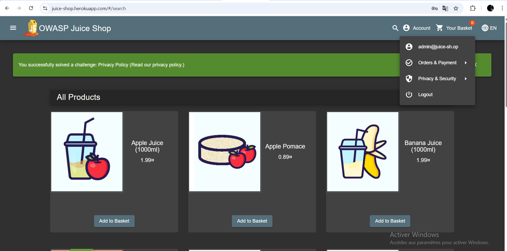

# SQL Injection Test Report
## Test 1: ' OR 1=1 --
- *Date*: 15/08/2025
- *Page*: /login
- *Result*: Success (Admin access)
- *Time Taken*: 5 minutes
- *Screenshot*: 

## Test 2: ' OR 'a'='a' --
- *Date*: 15/08/2025
- *Page*: /login
- *Result*: Success (Same result)
- *Difference*: 
  - Both payloads worked identically
  - No noticeable speed difference
  - ' OR 1=1 -- is more commonly used in documentation
  - ' OR 'a'='a' -- might bypass some basic filters
